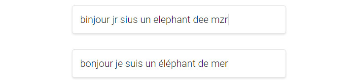

# Did U Mean ?

Correcteur orthographique de mots en nodejs.



## Dépendances
Ce projet require nodejs et l'installation de ses modules.

MarmWork nécessite plusieurs dépendances indispensables :

###NodeJs

Si NodeJs n'es pas installé sur votre ordinateur sous Windows et Mac : [nodejs.org](http://nodejs.org/)

Pour GNU/Linux, on installe NodeJs comme ceci : 

```shell
apt-get install nodejs
```

###Modules nodejs

Pour installer Grunt et les autres modules, il sufit de lancer cette commande à la racine du projet :

```shell
npm install
```

##Lancer les processus de compilations

Pour lancer les processus de compilation du Sass et du JavaScript, il suffit de lancer cette commande dans le dossier :

```shell
grunt
```

Pour éviter de devoir lancer la compilation à chaque modification, on peut utiliser cette commande :

```shell
grunt dev
```

Le serveur est lancé automatiquement à l'aide de la commande `grunt dev` mais peut être lancé grâce à la commande `node server/bin/server.js` depuis la racine du projet.

##Thanks :

- [http://norvig.com/spell-correct.html](http://norvig.com/spell-correct.html)